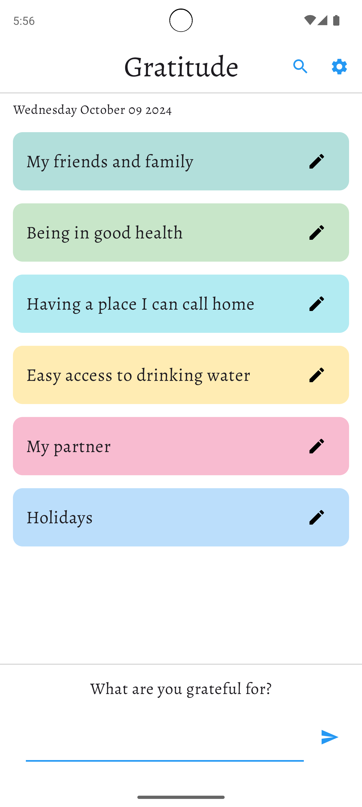
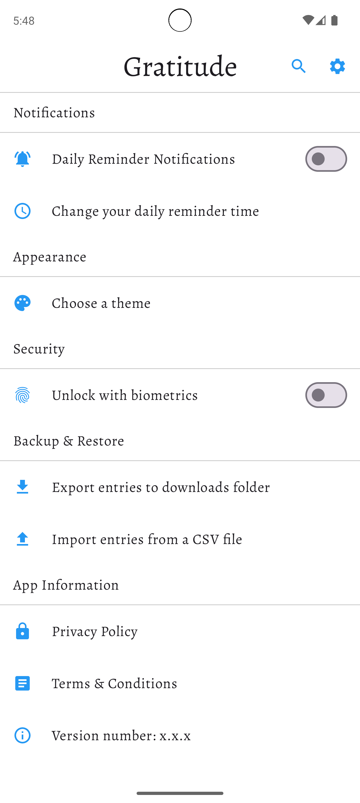

# Gratitude

Showcase Android application MVVM, clean architecture, Jetpack Compose and more

To see the list of current and upcoming features please take a look at the [feature roadmap](ROADMAP.md).

## Screenshots

| Empty | List | Settings |
| --- | --- | --- |
|  |  |  |

## Code quality

The following code quality tools are used:

* [Detekt](https://github.com/detekt/detekt) - Static code analysis for Kotlin code
* [Kotlinter](https://github.com/jeremymailen/kotlinter-gradle) - Static code analysis using [ktlint](https://github.com/pinterest/ktlint)
* [Android lint](http://tools.android.com/tips/lint) - scans Android code for bugs
* [Kover](https://github.com/Kotlin/kotlinx-kover) - collects test coverage data

How to run the code quality tools:

* Run `./gradlew check` to run all checks
* Run `./gradlew detekt` to run Detekt
* Run `./gradlew formatKotlin` to automatically format your code
* Run `./gradlew lintKotlin` to run ktlint via Kotlinter
* Run `./gradlew lint` to run Android lint

How to run the code coverage tools:
* Run `./gradlew :app:koverXmlReportDebug` to generate the Kover XML report
* Run `./gradlew :app:koverHtmlReportDebug` to generate the Kover HTML report

How to run the UI tests:
* Run `./gradlew connectedCheck`

How to generate the dependency graph:
* [Install `graphviz`](https://graphviz.gitlab.io/download/)
* Run `./gradlew projectDependencyGraph`. The [gradle file](gradle/projectDependencyGraph.gradle) is in the `gradle` folder
* The graph can be found at `/build/reports/dependency-graph/project.dot.png`